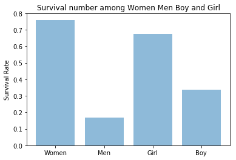
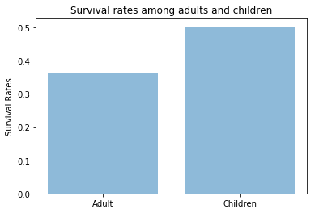
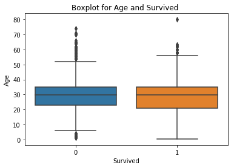
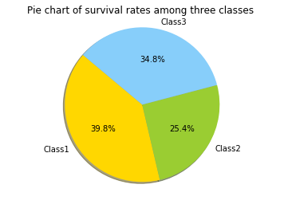
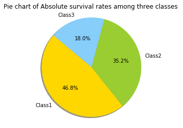
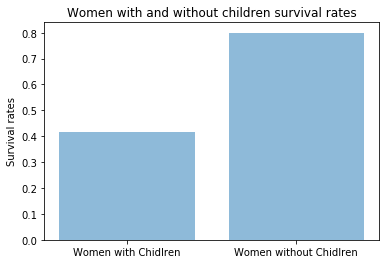

# Titanic Data Analysis


## Introduction
## Background information
 

"RMS Titanic was a British passenger liner that sank in the North Atlantic Ocean in the early morning hours of 15 April 1912, after it collided with an iceberg during her maiden voyage from Southampton to New York City. There were an estimated 2,224 passengers and crew aboard the ship, and more than 1,500 died."   ---"RMS Titanic." Wikipedia. Wikimedia Foundation, 13 July 2017. Web. 14 July 2017.

## Purpose of analysis

This Titanic data contains 891 passengers and crew members' information including Name, gender, survival and etc. 
The purpose of this analysis is to investigate the survival rates depending on several variables. 

One of the reasons that caused this tragedy is that there were not enough life boats and even a lot of the boats were not filled up. In this analysis, I am going to explore that which group of people had a higher survival rate.

## Questions

 1. Did women(age>18) had a higher survival rate than men (age>18)?
 2. Regardless of gender, did children(age< 18) had a higher survival rate than adults?
 3. Did people from Class 1 and 2 had a higher survival rate than people from Class 3?
 4. Did women who had children had a higher survival rate than women who did not have children on the board?

## Data Wrangling

### Data Dictionary
(from https://www.kaggle.com/c/titanic)

survival: Surivival(0 = No; 1 = YES)

pclass: Passenger Class (1 = 1st; 2 = 2nd; 3 = 3rd)

name: Name

sex: Sex

age: Age

sibsp: Number of Siblings/Spouses Aboard

parch: Number of Parents/Children Aboard

ticket: Ticket Number

fare: Passenger Fare

cabin: Cabin

embarked: Port of Embarkation (C = Cherbourg; Q = Queenstown; S = Southampton)

### Variable Notes 
pclass: A proxy for socio-economic status (SES)

1st = Upper
2nd = Middle
3rd = Lower

age: Age is fractional if less than 1. If the age is estimated, is it in the form of xx.5

sibsp: The dataset defines family relations in this way...
Sibling = brother, sister, stepbrother, stepsister
Spouse = husband, wife (mistresses and fiancés were ignored)

parch: The dataset defines family relations in this way...
Parent = mother, father
Child = daughter, son, stepdaughter, stepson
Some children travelled only with a nanny, therefore parch=0 for them.


```python
#import libraries
import pandas as pd
import numpy as np
import matplotlib.pyplot as plt
import seaborn as sns

%matplotlib inline
```


```python
# Loading the Titanic data#
titanic = pd.read_csv('c:/Users/Fan Liu/Downloads/titanic-data.csv')
```


```python
#To check on the fisrt 5 rows of data to have a basic idea
titanic.head()
```


<div>
<style>
    .dataframe thead tr:only-child th {
        text-align: right;
    }

    .dataframe thead th {
        text-align: left;
    }

    .dataframe tbody tr th {
        vertical-align: top;
    }
</style>
<table border="1" class="dataframe">
  <thead>
    <tr style="text-align: right;">
      <th></th>
      <th>PassengerId</th>
      <th>Survived</th>
      <th>Pclass</th>
      <th>Name</th>
      <th>Sex</th>
      <th>Age</th>
      <th>SibSp</th>
      <th>Parch</th>
      <th>Ticket</th>
      <th>Fare</th>
      <th>Cabin</th>
      <th>Embarked</th>
    </tr>
  </thead>
  <tbody>
    <tr>
      <th>0</th>
      <td>1</td>
      <td>0</td>
      <td>3</td>
      <td>Braund, Mr. Owen Harris</td>
      <td>male</td>
      <td>22.0</td>
      <td>1</td>
      <td>0</td>
      <td>A/5 21171</td>
      <td>7.2500</td>
      <td>NaN</td>
      <td>S</td>
    </tr>
    <tr>
      <th>1</th>
      <td>2</td>
      <td>1</td>
      <td>1</td>
      <td>Cumings, Mrs. John Bradley (Florence Briggs Th...</td>
      <td>female</td>
      <td>38.0</td>
      <td>1</td>
      <td>0</td>
      <td>PC 17599</td>
      <td>71.2833</td>
      <td>C85</td>
      <td>C</td>
    </tr>
    <tr>
      <th>2</th>
      <td>3</td>
      <td>1</td>
      <td>3</td>
      <td>Heikkinen, Miss. Laina</td>
      <td>female</td>
      <td>26.0</td>
      <td>0</td>
      <td>0</td>
      <td>STON/O2. 3101282</td>
      <td>7.9250</td>
      <td>NaN</td>
      <td>S</td>
    </tr>
    <tr>
      <th>3</th>
      <td>4</td>
      <td>1</td>
      <td>1</td>
      <td>Futrelle, Mrs. Jacques Heath (Lily May Peel)</td>
      <td>female</td>
      <td>35.0</td>
      <td>1</td>
      <td>0</td>
      <td>113803</td>
      <td>53.1000</td>
      <td>C123</td>
      <td>S</td>
    </tr>
    <tr>
      <th>4</th>
      <td>5</td>
      <td>0</td>
      <td>3</td>
      <td>Allen, Mr. William Henry</td>
      <td>male</td>
      <td>35.0</td>
      <td>0</td>
      <td>0</td>
      <td>373450</td>
      <td>8.0500</td>
      <td>NaN</td>
      <td>S</td>
    </tr>
  </tbody>
</table>
</div>


```python
#To have a basic picture about the numeric data
titanic.describe()
```


<div>
<table border="1" class="dataframe">
  <thead>
    <tr style="text-align: right;">
      <th></th>
      <th>PassengerId</th>
      <th>Survived</th>
      <th>Pclass</th>
      <th>Age</th>
      <th>SibSp</th>
      <th>Parch</th>
      <th>Fare</th>
    </tr>
  </thead>
  <tbody>
    <tr>
      <th>count</th>
      <td>891.000000</td>
      <td>891.000000</td>
      <td>891.000000</td>
      <td>714.000000</td>
      <td>891.000000</td>
      <td>891.000000</td>
      <td>891.000000</td>
    </tr>
    <tr>
      <th>mean</th>
      <td>446.000000</td>
      <td>0.383838</td>
      <td>2.308642</td>
      <td>29.699118</td>
      <td>0.523008</td>
      <td>0.381594</td>
      <td>32.204208</td>
    </tr>
    <tr>
      <th>std</th>
      <td>257.353842</td>
      <td>0.486592</td>
      <td>0.836071</td>
      <td>14.526497</td>
      <td>1.102743</td>
      <td>0.806057</td>
      <td>49.693429</td>
    </tr>
    <tr>
      <th>min</th>
      <td>1.000000</td>
      <td>0.000000</td>
      <td>1.000000</td>
      <td>0.420000</td>
      <td>0.000000</td>
      <td>0.000000</td>
      <td>0.000000</td>
    </tr>
    <tr>
      <th>25%</th>
      <td>223.500000</td>
      <td>0.000000</td>
      <td>2.000000</td>
      <td>20.125000</td>
      <td>0.000000</td>
      <td>0.000000</td>
      <td>7.910400</td>
    </tr>
    <tr>
      <th>50%</th>
      <td>446.000000</td>
      <td>0.000000</td>
      <td>3.000000</td>
      <td>28.000000</td>
      <td>0.000000</td>
      <td>0.000000</td>
      <td>14.454200</td>
    </tr>
    <tr>
      <th>75%</th>
      <td>668.500000</td>
      <td>1.000000</td>
      <td>3.000000</td>
      <td>38.000000</td>
      <td>1.000000</td>
      <td>0.000000</td>
      <td>31.000000</td>
    </tr>
    <tr>
      <th>max</th>
      <td>891.000000</td>
      <td>1.000000</td>
      <td>3.000000</td>
      <td>80.000000</td>
      <td>8.000000</td>
      <td>6.000000</td>
      <td>512.329200</td>
    </tr>
  </tbody>
</table>
</div>


### Data cleaning

By looking at the description, we can see that for the variable "Age" has a different count from other variables. It probably means there are missing values for the variable "Age". So let's check the missing values.

### 1. Checking on duplicate values


```python
#duplicate values
titanic_duplicates = titanic.duplicated()
print ('There are {} duplicate values(s) in data.'.format(titanic_duplicates.sum()))
```

    There are 0 duplicate values(s) in data.
    

Since there is no duplicate value in the data, then we can check the missing values.

Before that, I want to drop the unnecessary columns.

### 2.Drop unnecessary columns

There are 12 variables for total, but some of them are not related to my analysis, so I am going to drop them to clean the data.


```python
#Drop uncessary columns
titanic_new=titanic.drop(['PassengerId','Name','SibSp','Ticket','Fare','Cabin','Embarked'],axis=1)
titanic_new.head()
```


<div>
<table border="1" class="dataframe">
  <thead>
    <tr style="text-align: right;">
      <th></th>
      <th>Survived</th>
      <th>Pclass</th>
      <th>Sex</th>
      <th>Age</th>
      <th>Parch</th>
    </tr>
  </thead>
  <tbody>
    <tr>
      <th>0</th>
      <td>0</td>
      <td>3</td>
      <td>male</td>
      <td>22.0</td>
      <td>0</td>
    </tr>
    <tr>
      <th>1</th>
      <td>1</td>
      <td>1</td>
      <td>female</td>
      <td>38.0</td>
      <td>0</td>
    </tr>
    <tr>
      <th>2</th>
      <td>1</td>
      <td>3</td>
      <td>female</td>
      <td>26.0</td>
      <td>0</td>
    </tr>
    <tr>
      <th>3</th>
      <td>1</td>
      <td>1</td>
      <td>female</td>
      <td>35.0</td>
      <td>0</td>
    </tr>
    <tr>
      <th>4</th>
      <td>0</td>
      <td>3</td>
      <td>male</td>
      <td>35.0</td>
      <td>0</td>
    </tr>
  </tbody>
</table>
</div>


### 3. Specify missing values


```python
titanic_new.isnull().head()
```


<div>
<table border="1" class="dataframe">
  <thead>
    <tr style="text-align: right;">
      <th></th>
      <th>Survived</th>
      <th>Pclass</th>
      <th>Sex</th>
      <th>Age</th>
      <th>Parch</th>
    </tr>
  </thead>
  <tbody>
    <tr>
      <th>0</th>
      <td>False</td>
      <td>False</td>
      <td>False</td>
      <td>False</td>
      <td>False</td>
    </tr>
    <tr>
      <th>1</th>
      <td>False</td>
      <td>False</td>
      <td>False</td>
      <td>False</td>
      <td>False</td>
    </tr>
    <tr>
      <th>2</th>
      <td>False</td>
      <td>False</td>
      <td>False</td>
      <td>False</td>
      <td>False</td>
    </tr>
    <tr>
      <th>3</th>
      <td>False</td>
      <td>False</td>
      <td>False</td>
      <td>False</td>
      <td>False</td>
    </tr>
    <tr>
      <th>4</th>
      <td>False</td>
      <td>False</td>
      <td>False</td>
      <td>False</td>
      <td>False</td>
    </tr>
  </tbody>
</table>
</div>


If we look at the whole graph, we can see that there are some missing values in variable "Age", and "Age" is a crucial variable
in the analysis, so we need to figure out how many missing values in the variable "Age".


```python
# Review some of the missing Age data
titanic_new.isnull().sum()
```


    Survived      0
    Pclass        0
    Sex           0
    Age         177
    Parch         0
    dtype: int64


There are 177 missing values in the variable 'Age' out of 891 total values. The percentage of the missing value is about 20%, which I think it will have some influence on our data analysis. We need to keep this as notes.


```python
#Then let's find out the missing value
missing_age=pd.isnull(titanic['Age'])
titanic[missing_age].head()
```


<div>
<table border="1" class="dataframe">
  <thead>
    <tr style="text-align: right;">
      <th></th>
      <th>PassengerId</th>
      <th>Survived</th>
      <th>Pclass</th>
      <th>Name</th>
      <th>Sex</th>
      <th>Age</th>
      <th>SibSp</th>
      <th>Parch</th>
      <th>Ticket</th>
      <th>Fare</th>
      <th>Cabin</th>
      <th>Embarked</th>
    </tr>
  </thead>
  <tbody>
    <tr>
      <th>5</th>
      <td>6</td>
      <td>0</td>
      <td>3</td>
      <td>Moran, Mr. James</td>
      <td>male</td>
      <td>NaN</td>
      <td>0</td>
      <td>0</td>
      <td>330877</td>
      <td>8.4583</td>
      <td>NaN</td>
      <td>Q</td>
    </tr>
    <tr>
      <th>17</th>
      <td>18</td>
      <td>1</td>
      <td>2</td>
      <td>Williams, Mr. Charles Eugene</td>
      <td>male</td>
      <td>NaN</td>
      <td>0</td>
      <td>0</td>
      <td>244373</td>
      <td>13.0000</td>
      <td>NaN</td>
      <td>S</td>
    </tr>
    <tr>
      <th>19</th>
      <td>20</td>
      <td>1</td>
      <td>3</td>
      <td>Masselmani, Mrs. Fatima</td>
      <td>female</td>
      <td>NaN</td>
      <td>0</td>
      <td>0</td>
      <td>2649</td>
      <td>7.2250</td>
      <td>NaN</td>
      <td>C</td>
    </tr>
    <tr>
      <th>26</th>
      <td>27</td>
      <td>0</td>
      <td>3</td>
      <td>Emir, Mr. Farred Chehab</td>
      <td>male</td>
      <td>NaN</td>
      <td>0</td>
      <td>0</td>
      <td>2631</td>
      <td>7.2250</td>
      <td>NaN</td>
      <td>C</td>
    </tr>
    <tr>
      <th>28</th>
      <td>29</td>
      <td>1</td>
      <td>3</td>
      <td>O'Dwyer, Miss. Ellen "Nellie"</td>
      <td>female</td>
      <td>NaN</td>
      <td>0</td>
      <td>0</td>
      <td>330959</td>
      <td>7.8792</td>
      <td>NaN</td>
      <td>Q</td>
    </tr>
  </tbody>
</table>
</div>


From the descriptive table, we can see that the median for 'Age' is 28, and the mean for 'Age' is 29. Median and mean are close so I can assume that the variation of the data is not big. 

I am going to replace the missing values with means to make my analysis more accurate.


```python
#Replace the missing values by mean
titanic_new1=titanic_new.fillna(titanic_new.mean())
titanic_new1.head()
```


<div>
<table border="1" class="dataframe">
  <thead>
    <tr style="text-align: right;">
      <th></th>
      <th>Survived</th>
      <th>Pclass</th>
      <th>Sex</th>
      <th>Age</th>
      <th>Parch</th>
    </tr>
  </thead>
  <tbody>
    <tr>
      <th>0</th>
      <td>0</td>
      <td>3</td>
      <td>male</td>
      <td>22.0</td>
      <td>0</td>
    </tr>
    <tr>
      <th>1</th>
      <td>1</td>
      <td>1</td>
      <td>female</td>
      <td>38.0</td>
      <td>0</td>
    </tr>
    <tr>
      <th>2</th>
      <td>1</td>
      <td>3</td>
      <td>female</td>
      <td>26.0</td>
      <td>0</td>
    </tr>
    <tr>
      <th>3</th>
      <td>1</td>
      <td>1</td>
      <td>female</td>
      <td>35.0</td>
      <td>0</td>
    </tr>
    <tr>
      <th>4</th>
      <td>0</td>
      <td>3</td>
      <td>male</td>
      <td>35.0</td>
      <td>0</td>
    </tr>
  </tbody>
</table>
</div>


## Data Exploration and Visualization

### Question 1 
### Did women had a higher survival rate than men with (age>18)or girl would have higher survival rates than boy?


```python
#Number of women survived
women_survived=titanic_new1.loc[
    ((titanic_new1['Sex'] == 'female') &
     (titanic_new1['Survived'] == 1) &
      (titanic_new1['Age'] > 18 ))]


#Number of women
women=titanic_new1.loc[
    ((titanic_new1['Sex'] == 'female') & 
    (titanic_new1['Age'] > 18))]

#Number of men survived
men_survived=titanic_new1.loc[
    ((titanic_new1['Sex'] == 'male') &
     (titanic_new1['Survived'] == 1) &
      (titanic_new1['Age'] > 18 ))]

#Number of men
men=titanic_new1.loc[
    ((titanic_new1['Sex'] == 'male') & 
    (titanic_new1['Age'] > 18))]

#Female surivial rates
women_survival_rate=len(women_survived)/len(women)

#Male survival rates
men_survival_rate=len(men_survived)/len(men)

print ('The women survival rate is {}.'.format(women_survival_rate))
print ('The men survival rate is {}.'.format(men_survival_rate))
```

    The women survival rate is 0.7601626016260162.
    The men survival rate is 0.16798418972332016.
    


```python
#Let's compare girl's and boy's suvival rates
#Number of girl survived
girl_survived=titanic_new.loc[
    ((titanic_new['Sex'] == 'female') &
     (titanic_new['Survived'] == 1) &
      (titanic_new['Age'] <= 18 ))]

#Number of girl
girl=titanic_new.loc[
    ((titanic_new['Sex'] == 'female') & 
    (titanic_new['Age'] <= 18))]

#Number of boy survived
boy_survived=titanic_new.loc[
    ((titanic_new['Sex'] == 'male') &
     (titanic_new['Survived'] == 1) &
      (titanic_new['Age'] <= 18 ))]

#Number of boy
boy=titanic_new.loc[
    ((titanic_new['Sex'] == 'male') & 
    (titanic_new['Age'] <= 18))]

#Girl surivial rates
girl_survival_rate=len(girl_survived)/len(girl)

#Boy survival rates
boy_survival_rate=len(boy_survived)/len(boy)

print ('The girl survival rate is {}.'.format(girl_survival_rate))
print ('The boy survival rate is {}.'.format(boy_survival_rate))
```

    The girl survival rate is 0.6764705882352942.
    The boy survival rate is 0.3380281690140845.
    


```python
#Graph above four groups
chart = ('Women', 'Men','Girl','Boy')
graph = np.arange(len(chart))
count_graph = [women_survival_rate,men_survival_rate,girl_survival_rate,boy_survival_rate]

plt.bar(graph, count_graph, align='center', alpha=0.5)
plt.xticks(graph, chart)
plt.ylabel('Survival Rate')
plt.title('Survival number among Women Men Boy and Girl')
 
plt.show()

```





By observing the graph, I can see that, in general, women and girl had higher survival rates than men and boy. 

I would like to answer my firsr question "Yes".


### Quesiton 2:
### Regardless of gender, did children(age < 18) had a higher survival rate than adults?

There is no variable called 'children', so I am creating a variable called children with age is less than 18. And also I am creating a variable called adult when age is greater or equal than 18.


```python
#Variable 'Children'
titanic_children=titanic_new1.loc[(titanic_new1['Age'] <= 18)]
len(titanic_children)

#The number of children survived 
children_survival=titanic_new1.loc[
    ((titanic_new1['Age'] <= 18) &
    (titanic_new1['Survived'] == 1))]
    
len(children_survival)

print ('The number of children on board was {}.'.format(len(titanic_children)))
print ('The number of children survived that night was {}.'. format(len(children_survival)))
```

    The number of children on board was 139.
    The number of children survived that night was 70.
    


```python
#Children's survival rates
children_survival_rate=len(children_survival)/len(titanic_children)
children_survival_rate

print ('The survival rate of children is {}.'.format(children_survival_rate))
```

    The survival rate of children is 0.5035971223021583.
    

#### Then let's' find out the adults' survival rate and make a comparison with childrens'.


```python
#The number of adults
titanic_adult=titanic_new1.loc[(titanic_new1['Age'] > 18)]
len(titanic_adult)

#The number of adults survived
adult_survival=titanic_new1.loc[
    ((titanic_new1['Age'] > 18) &
    (titanic_new1['Survived'] == 1))]
len(adult_survival)


print('The number of adults on board is {}.'.format(len(titanic_adult)))
print('The number of adult survived on board is {}.'.format(len(adult_survival)))
```

    The number of adults on board is 752.
    The number of adult survived on board is 272.
    


```python
#Adult's survival rate
adult_survival_rate=len(adult_survival)/len(titanic_adult)
adult_survival_rate

print ('The adult survival rate is {}.'.format(adult_survival_rate))
```

    The adult survival rate is 0.3617021276595745.
    


```python
#Creating bar chart to compare adult and children's survival rates
objects = ('Adult', 'Children')
y_pos = np.arange(len(objects))
performance = [adult_survival_rate,children_survival_rate]

plt.bar(y_pos, performance, align='center', alpha=0.5)
plt.xticks(y_pos, objects)
plt.ylabel('Survival Rates')
plt.title('Survival rates among adults and children')
 
plt.show()
```





From the bar chart and the statistics, we can see that children's survival rate is higher than Adult. 
The adult's survival rate is 0.3826, and children's survival rate is 0.5036.


The survival rates difference between adult and children is not big, so let's draw a boxplot.


```python
#Boxplot by age accorss the survived
g = sns.boxplot(x="Survived", y="Age", data=titanic_new1)

g.set_title('Boxplot for Age and Survived ')
```


    <matplotlib.text.Text at 0x1978a0263c8>





By looking at the boxplot we can see Age is not a crucial factor for survival rates.

### Question 3
### Did people from class 1 and 2 had a higher survival rate than people from class 3?


```python
#Survived poeple from class 1
class1_survived=titanic_new1.loc[
    ((titanic_new1['Pclass'] == 1) &
     (titanic_new1)['Survived'] == 1)]

#Survived people from class 2
class2_survived=titanic_new1.loc[
    ((titanic_new1['Pclass'] == 2) &
     (titanic_new1)['Survived'] ==1)]

#Survived people from class 3
class3_survived=titanic_new1.loc[
    ((titanic_new1['Pclass'] == 3) &
     (titanic_new1)['Survived'] ==1)]

print ('The number of people survived from class1 was {}.'.format(len(class1_survived)))
print ('The number of people survived from class2 was {}.'.format(len(class2_survived)))
print ('The number of people survived from class3 was {}.'.format(len(class3_survived)))


#Creating pie chart to compare survival rates among 3 different classes.

labels = 'Class1','Class2','Class3'
sizes = [len(class1_survived),len(class2_survived),len(class3_survived)]
colors = ['gold', 'yellowgreen', 'lightskyblue']

 
# Plot
plt.pie(sizes,labels=labels, colors=colors,
        autopct='%1.1f%%', shadow=True, startangle=140)
plt.title('Pie chart of survival rates among three classes ')
 
plt.axis('equal')
plt.show()
```

    The number of people survived from class1 was 136.
    The number of people survived from class2 was 87.
    The number of people survived from class3 was 119.
    





By looking at the bar chart we can see that the survival rates for class1(39.8%) and class3(34.8%) are pretty close, which is different as I thought.Based on this result, social class is not factor to survival rates.

However, I calculate the survival rates based on the total population. If I calcuate the absolute survival rates for each class, I might get a different answer.


```python
class1_number=titanic_new1.loc[(titanic_new1['Pclass'] == 1)]
class2_number=titanic_new1.loc[(titanic_new1['Pclass'] == 2)]
class3_number=titanic_new1.loc[(titanic_new1['Pclass'] == 3)]

class1_survival_rates=len(class1_survived)/len(class1_number)
class2_survival_rates=len(class2_survived)/len(class2_number)
class3_survival_rates=len(class3_survived)/len(class3_number)

#Creating pie chart to compare absolute survival rates among 3 different classes.
labels = 'Class1','Class2','Class3'
sizes = [class1_survival_rates,class2_survival_rates,class3_survival_rates]
colors = ['gold', 'yellowgreen', 'lightskyblue']

 
# Plot
plt.pie(sizes,labels=labels, colors=colors,
        autopct='%1.1f%%', shadow=True, startangle=140)

plt.title('Pie chart of Absolute survival rates among three classes ')
 
plt.axis('equal')
plt.show()
```





By observing the survival rates chart, we can see that the people from class1 had a higher survival rate than class2 and class2 had a survival rate than class3.

The results are different with the statistic we got from the absolute number.
From above, we got the result that people from class1 and class1 had a similar survival number of people; however, if we observe percentage of survival rates for each class based on how many people were there for each class. We can tell that even though there are 139 and 119 people survived respectively from class1 and class3, but there are 491 people from class3 and only 261 people from class1.

My conclusion is that people from upper social class has a higher survival rate than people from middle class and lower class.

### Question 4
#### Did women who have children have a higher survival rate than women who do not have children on the board?
##### The variable we are using here is 'parch': Number of Parents/Children Aboard.


```python
#Since the values in the 'parch' variable can be 0 up to 8, so I will calculate the number of women who does not have children 
#or parents on boat and then substract by the total number.

#Number of women who does not have children on board
women_nochildren=titanic_new1.loc[
    ((titanic_new1['Age'] > 25) &
     (titanic_new1['Parch'] == 0) &
     (titanic_new1['Sex'] == 'female'))]
women_nochildren_survival=titanic_new1.loc[
        ((titanic_new1['Age'] > 25) &
         (titanic_new1['Parch'] == 0) &
         (titanic_new1['Survived'] == 1) &
         (titanic_new1['Sex'] == 'female'))]

#Survival rate for women who did not have children on board.
women_nochidren_survival_rate=len(women_nochildren_survival)/len(women_nochildren)
women_nochidren_survival_rate

print ('The survival rate for women who had no children on board is {}.'.format(women_chidren_survival_rate))


```

    The survival rate for women who had no children on board is 0.8.
    


```python
#Total survival rates for women
women_survival=titanic_new1.loc[
    ((titanic_new1['Survived'] == 1) &
    (titanic_new1['Sex'] == 'female'))]


#Number of women who have children
women_children=len(women)-len(women_nochildren)

#Survival rate for women who had children
women_children_survival=len(women_survival)-len(women_nochildren_survival)
women_children_survival_rate=women_children_survival/len(women_survival)
women_children_survival_rate    

print('Survival rate for women who had children is {}.'.format(women_children_survival_rate))
```

    Survival rate for women who had children is 0.41630901287553645.
    


```python
#Graph to compare women with and without children's survival rates
chart_c = ('Women with Chidlren', 'Women without Chidlren')
graph_c = np.arange(len(chart_c))
count_graph_c = [women_children_survival_rate, women_nochidren_survival_rate]

plt.bar(graph_c, count_graph_c, align='center', alpha=0.5)
plt.xticks(graph_c, chart_c)
plt.ylabel('Survival rates')
plt.title('Women with and without children survival rates')
 
plt.show()
```





We can see that women with children's survival rate is only hald of the women without children. so variable 'Parch' is a significant variable for survive.

The result is different as I thought, I thought that women's survival rates shouldn't be this much difference depending on the variable 'parch'.

I would like to answer my 4th question with NO.

### Conclusion

According to the analysis, we can see that women did have a higher survival rate than man(Q1). And as children would have a higher survival rate than the adult. Thirdly, people from upper social class definitely had a high survival rate than people from lower social class(Q3). Finally, women with without children had a higher survival rate than those who did not(Q4).

Based on the analysis above, we can see that the women from upper class were most likely to survive since women had a so much higher survival rates than men, and class1's survival rate is the hightest. On the other hand, we can say that man from class3 has the lowest survival rate.

However, Age did not seem to be a major factor based on the analysis.

This data only contains 891 data values out of 2224 for the total number. The data set is less than half the total data, so there might be some unbiased since the data are not fully investigated.


### Notes

I use the mean of 'Age' to replace the missing value which should be noted.
Replacing the missing value with means can make the data more accurate. During the analysis, I need to create variables called adult and child which are all age related.If I keep them with NA, then the 'AGE' variable would only have 714 values. 


The category of 'children' was assumed to be anyone under the age of 18, using today's North American standard for adulthood which was certainly not the case in the 1900s

### References

https://www.kaggle.com/c/titanic/data

https://en.wikipedia.org/wiki/RMS_Titanic
